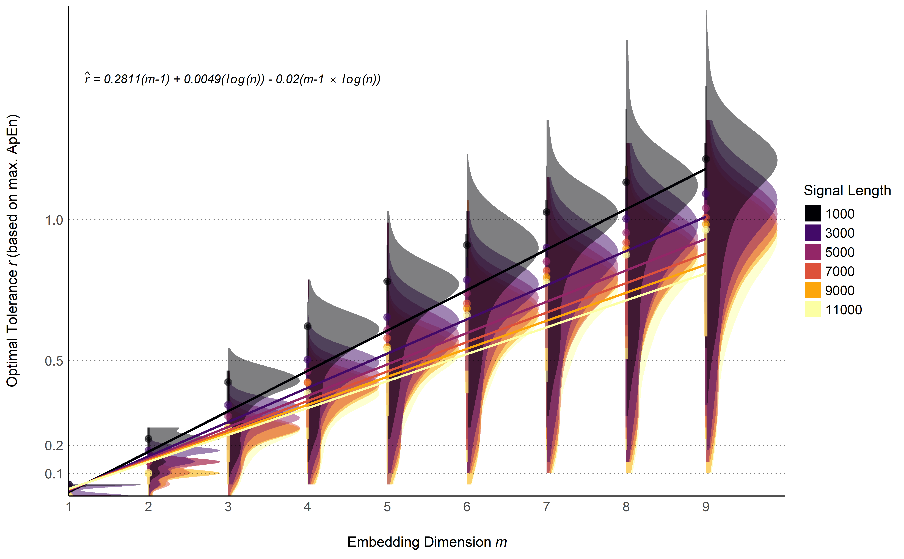

# A New Heuristic Method for the Optimal Selection of Tolerance *r* for Entropy Indices

- See the open-access [**preprint**](https://github.com/DominiqueMakowski/ComplexityTolerance/blob/main/manuscript.pdf).
- Data generation [**script**](make_data.py)
- Data analysis [**script**](manuscript.Rmd)

## Abstract

The tolerance threshold *r* is a key parameter of several entropy algorithms (e.g., *SampEn*). Unfortunately, the gold standard method to estimate its optimal value - i.e., the one that maximizes *ApEn* - is computationally costly, prompting users to rely on cargo-cult rules-of-thumb such as 0.2 * SD. This simulation study aims at validating a new heuristic, based on the embedding dimension *m* and the signal's length *n* (optimal *r* = SD \* 0.281(*m*-1) + 0.005(log(*n*)) - 0.02(*m*-1 \* log(*n*))), which was found to be superior to other existing heuristics. All the methods of optimal tolerance *r* estimation used in this study are available in the *NeuroKit2* Python software (Makowski et al., 2021).

